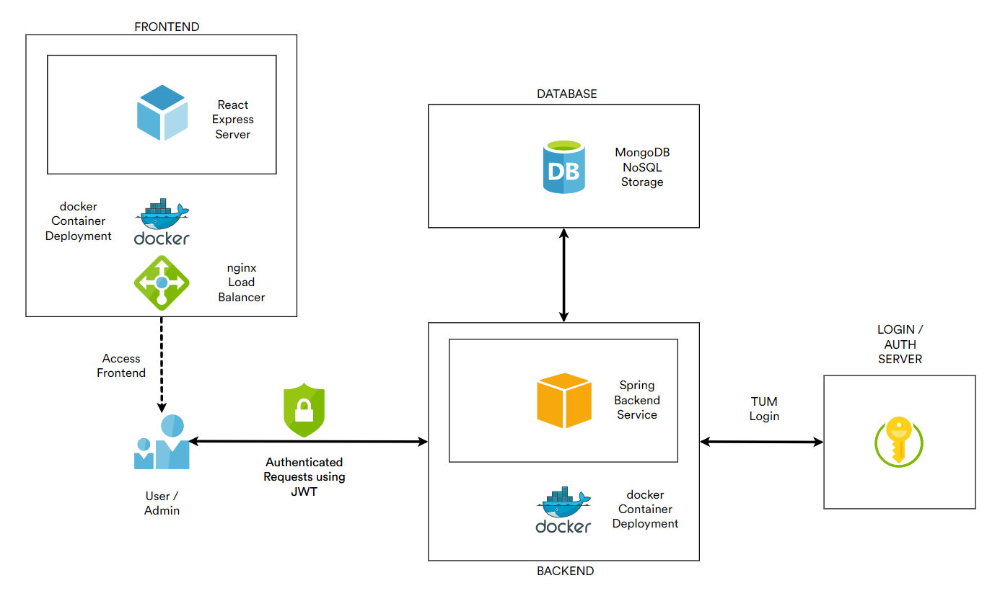
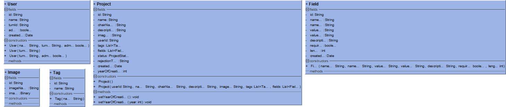
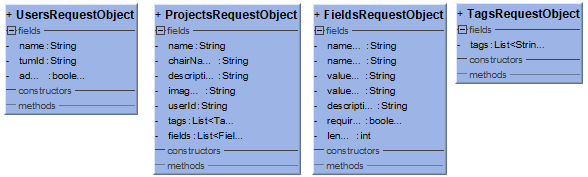
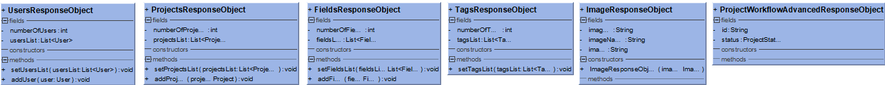
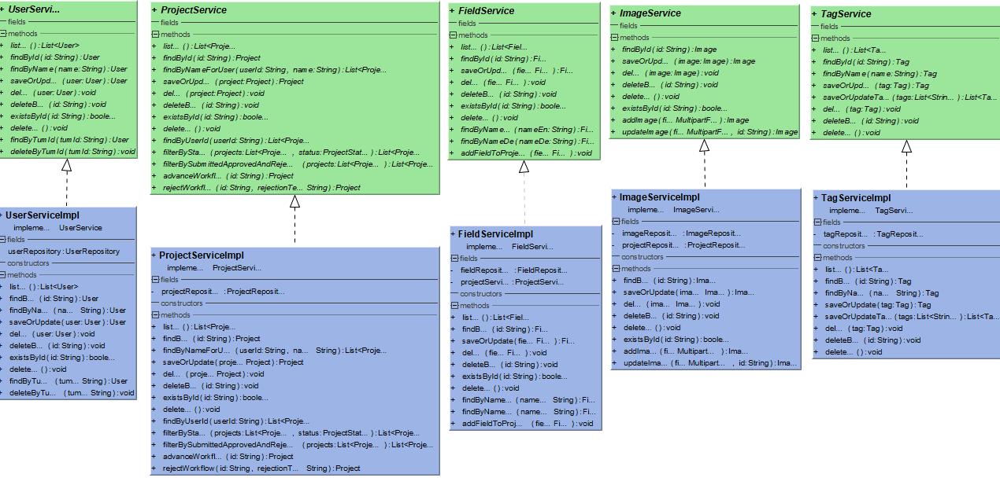
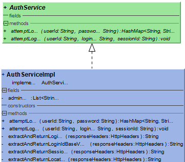
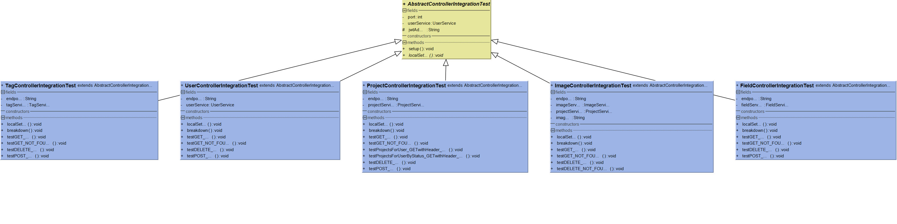

# Introduction

Various research and development projects at the faculty of Architecture are in preparation, in progress or have already been completed.

As of now, there is no central data management system or platform to manage any planned, current and already completed research projects. These are currently tracked and checked using an Excel workbook that needs manual checking and updating every time a new project is created, modified or its status changed.

Due to increasing research activities and larger collaborative projects, there is an urgent need here for a better solution. The focus of this project is on the implementation of a web based central research management system. The system itself will consist of the database, the user interface and the data-providing backend service of the application. Once implemented, it will allow users to create, manage and export their research projects, all centrally stored in one place.

## Current Scenario

There are currently numerous research projects at the department that are listed on the chair's website [here](https://www.ar.tum.de/forschung/projekte) and various other projects currently still in progress. But unfortunately, there is no central data management system in place and hence projects are being tracked manually.
As part of the manual process, data is currently being updated on Excel and this process of continuously updating data is challenging. As the number of research activities continue to increase, there would be larger collaborative projects and managing them manually would be an even bigger hassle.

## Our Solution

To avoid such manual hassle and local updating of projects and their status, we will be implementing a new web platform that consists of a user friendly user interface(UI) and a database that centrally stores all the data in one place. All the research projects would be easily accessible and would be completely managed on the platform.
Users can create and export their projects and the entire workflow would be taken care of by the platform. There would be no need for manually handling all these steps.

## Requirements

**Functional and Non Functional Requirements:**

- User administration and access

- Authentication and authorization with TUM-login

- Create, view, edit and delete projects

- Workflow for submitting, approving and rejecting projects

- Automatic generation of printable PDFs from exportable data

- Implementation of configurable forms & fields

- Bilingual website (DE/EN)

- Indexing of research projects

# System Design


**Frontend (UI)**

- ReactJS
- MaterialUI
- Redux

**Database**

- MongoDB

**Backend**

- Java-SpringBoot based service

**Deployment**

- Docker
- Nginx
- GitLab CI

**API Documentation**

- Swagger

## Architecture



## Modelling

### Class Diagrams

#### Base Data Models



#### API Request Data Models



#### API Response Data Models



#### Services

**Base Services**


**Auth Service**


## Testing

The following testing libraries are used for all tests on the backend:

- JUnit
- AssertJ
- Rest-Assured
- Spring-Boot Test

There are two types of tests that are covered thoroughly:

- **Integration Tests**

  These tests are ideal for testing a combination of individual units. The purpose of these tests is to expose any fault or issue in the interaction between the combined functionality.

  We have integration tests for all major business logic and service functionality.

- **API Tests**

  These tests are used to test Application Programming Interfaces (APIs) directly. In our case, we specifically test all the RESTful APIs available to our Frontend application. We perform these tests with the intention of keeping the Backend service independent of the Frontend. For this reason we carry out testing via RESTful HTTP calls made using Rest-Assured.

  Since our REST APIs need authenticated and authorized calls to return successful responses, for the purpose of testing only, we use mock Authentication tokens (JSON Web Tokens).

The following diagram represents a Class based view of the Integration Tests covered in the application:



# Administrator Manual

## Running the application stack

Currently both the frontend and the backend source files are hosted on the LRZ GitLab repository that can be found [here](https://gitlab.lrz.de/tum-arch) under the ground name _"tum-arch"_. There are 2 repositories under this group namely _"research-platform-web"_ for the frontend application and _"research-platform-service"_ for the backend application.

### Frontend Service:

In order to run the frontend service, you would need to first _clone_ the repository locally on your personal computer. You can do so by running the following command:

```
git clone https://gitlab.lrz.de/tum-arch/researchplatform-web.git
```

Now at the root directory, install the dependencies by running the following command:

```
yarn install
```

If you do not have yarn installed, you can install it from [here](https://classic.yarnpkg.com/en/docs/install)

To run the application in the development mode, run the following command in the root directory:

```
yarn start
```

You can also run with docker by running the following command at the root directory:

```
docker-compose up
```

This will bring up the react frontend app served over `nginx` and exposed on port 3000.

### Backend Service:

The backend application is a `Spring-Boot` application based on `Java (JDK11)`. The database used is `MongoDB`. In order to run the backend service, you would need to first _clone_ the repository locally on your personal computer. You can do so by running the following command:

```
git clone https://gitlab.lrz.de/tum-arch/researchplatform-web.git
```

##### Setup MongoDB locally

To setup a local database instance, install the community server from [here](https://www.mongodb.com/try/download/community) and set it up to start at `localhost` with port `27017` without any authentication.

##### Ensure tests are running successfully

To ensure both API and integration tests are running successfully, run the following in the root directory:

```
./mvnw test
```

##### Build the project

To build, run the following command in the root directory:

```
./mvnw install -DskipTests=true
```

##### Running the Spring Boot module

To run the Spring Boot module and connect to a local DB instance run the following command in the root directory:

```
./mvnw spring-boot:run
```

This will attempt to connect to a MongoDB instance running locally on localhost with port 27017.

##### Information

```
Spring service will start on localhost on port 5000.
```

##### Run with Docker

To run with docker, simply run:

```
docker-compose up
```

This will start the spring service on a container exposed to port `5000`. This docker based service is connected to the main DB deployed online.

## Application Structure and Functionalities

### Frontend Application:

The entry point to our application is `index.js`.

Application state and logic while it is running is stored in a certain `store` created in the file `store.js`.

The directory and component structure of the rest of the frontend application is as below:

- **Actions**: Actions are payloads of information that send data from your application to your store.
- **Components**: These are the actual UI views that are independent, reusable pieces. We will look at some of our major components.
- **Reducers**: Reducers specify how the application's state changes in response to actions sent to the store.
- **Theme**: These are the fonts and palette colors used for our entire application. There is also a file that is used to style the pdf document generated from our application.
- **Translations**: These are the JSON files that map a key to the corresponding value in the specified languages (in our case English and German)

These are the following components available on the Frontend Application:

1. `AuthAdmin` and `AuthUser` are used to check if the user is an admin or not.

2. `CreateEditField` is the component that creates and edits "configurable forms & fields". This option is available only to the admins by clicking the settings button on the header as highlighted below:

   

3. `Display Projects` displays the projects in the grid fashion as seen in the image above.

4. `ErrorPage` is the default redirection page in case of any errors.

5. `Header` is the header component visible at the top of the page that contains the logo, the search bar, the bilingual language option, the admin settings and the logout button.

6. `LoginPage` is the page that lands when the user hits the URL. The authentication using the `TUM ID` happens here.

7. `PDFDoc` is the layout of the pdf document to be exported.

8. `Project` is the individual grid component. The `Display Projects` component displays multiple `Project` components.

9. `RejectProjectDialog` is the component that appears when the admin rejects the project wherein the reason for rejection is mentioned.

10. `SettingsPage` is the admin settings page where in he/she configures the fields for the forms.

11. `UserPage` is the main page that the user lands on when he/she logs in as seen in the image above.

##### Change the styles for the downloadable PDFs:

The steps to change the pdf styles are as below:

1. The default styles are in the file `src/theme/pdfDocCSS.js`. Currently the styles are as follows:

   ```
   fieldName: {
   	fontSize: 18,
   	margin: 12,
   	marginBottom: 2,
   	fontFamily: "Times-Roman",
   }
   ```

2. The above styles will be applied to all the custom fields by default.

3. In order to design the custom fields, you need to add the styles as above to the same file `src/theme/pdfDocCSS.js` with the English-name of the field. For eg: If you want to style the field with the English name mentioned as "department" then you would have to add the following code to the file:

   ```
   department: {
   	fontSize: 12,
   	margin: 12,
   	marginBottom: 2,
   	fontFamily: "Helvetica Neue",
   }
   ```

4. You can also modify the styles for the fields like name, department, and others in the same file. To know the styling options and valid properties available, you can check [here](https://react-pdf.org/styling#valid-css-properties).

5. All off the above is possible assuming these custom fields have been created.

### Backend Application:

The application entry point is `src/main/java/de/tum/ar/researchplatform/ResearchplatformApplication.java`.

The directory and component structure of the backend application is as below:

- **Security**: Here the authentication and authorization process takes place, with the various filters being applied like the JSON Web Tokens(JWT) filter where the JWT tokens are built for the users.
- **Configuration**: This is the web security configuration like the CORS policies and the whitelisting of IPs. The Swagger configuration is also part of this folder.
- **Controller**: These are the Endpoints that the user can access from the web application.
- **Exception**: The Exceptions and their handlers thrown in case of errors are defined here.
- **Model**: The major models of our application are mentioned here. We have the following classes:
  - User
  - Project
  - Field
  - Image
  - Tag
- **Repository**: The classes mentioned above have their respective repositories which are used to access their data collection from the database.
- **Service**: Business logic is handled here.
- **Util**: The admins list and the constants used in the application are found here.
- **Test**: For every `controller` and `service`, there are both unit and integration tests written and are run before the startup of the application to make sure there are no bugs in the system. Currently there are `37 tests` being run in total.

##### API Documentation through Swagger:

Swagger can be used to test APIs on the browser. You can view the available endpoints and perform tests and fire requests quickly and easily. The Swagger UI for our REST API Documentation looks as below:


##### How to add admins to the platform:

The list of admins is available in the file name `Admins.java` which can be found under the following path:

```
src/main/java/de/tum/ar/researchplatform/util/Admins.java
```

Just add the `tum guid` to the `admin` array in the following code-block:

```
public static final String[] admins = new String[]{
            "ge79***",
    };
```

##### Security: How to modify JSON Web Token details:

The JWT details are stored in the Constants class found in the path:

```
src/main/java/de/tum/ar/researchplatform/util/Constants.java
```

##### Database: How to modify production database connection string:

The production database string property _spring.data.mongodb.uri_ can be modified in this file:

```
src/main/resources/application-prod.properties
```

# Future Enhancements

We think the following additions could enhance this platform:

- Using LDAP for TUM login: This would in turn enable mapping of faculties and projects and help in better visualization of the projects created.
- Creating a notification system notifying administrators when a new project has been submitted.
- Enhancing the custom field capabilities with options to create Date/Time handlers, radio buttons, etc.
